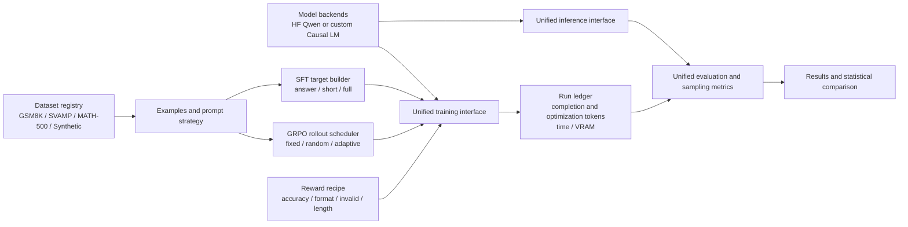
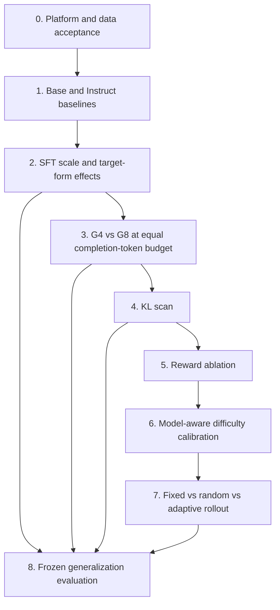

# Qwen2.5-3B Reasoning Alignment Framework and Experiment System

## Status and scope

This is the approved design for an experiment system centred on
`Qwen/Qwen2.5-3B`. It must preserve an integration path for a self-trained,
plain-PyTorch causal language model. This document covers architecture,
experiment protocol, configuration, dependencies, and a single-RTX-4090
execution plan. It does not authorize downloading Qwen2.5-3B, launching
formal training, or a large refactor.

The work is deliberately split into two implementation sub-projects:

1. Research-platform completeness and reproducibility.
2. Experiment orchestration and execution after the platform is accepted.

## Research questions

With training data and rollout completion-token budgets controlled, measure
how SFT dataset size, SFT output form, GRPO group size, KL coefficient, reward
composition, and model-aware difficulty-adaptive sampling affect:

- mathematical reasoning accuracy;
- sampled exploration capability;
- cross-dataset generalization;
- output length; and
- compute efficiency.

The study must answer the following questions:

1. How do Qwen2.5-3B Base and Instruct differ before alignment?
2. How much does GSM8K SFT improve Base?
3. Which SFT target is preferable: answer-only, short rationale, or full
   rationale?
4. At equal completion-token budget, is G=8 better than G=4 beyond using more
   rollout tokens?
5. How do KL settings affect accuracy, approximate KL, entropy, and stability?
6. Do format reward, invalid-output penalty, and length control help?
7. Do GRPO gains transfer to SVAMP and MATH-500?
8. Is model-aware difficulty more reliable than manually assigned difficulty?
9. At equal completion-token budget, does difficulty-adaptive rollout improve
   over fixed group size and random allocation?
10. Is any gain worth the added GPU time and generated-token cost?

## Architecture

The system is organised as independent configuration-driven layers:



### Model boundary

`src.models.backend.ModelBackend` remains the sole boundary used by trainers,
generators, and evaluators. The Hugging Face adapter serves Qwen. A self-built
causal LM enters through a registered factory plus tokenizer/tokenizer-adapter
and explicit `ModelCapabilities`. Trainers must not depend on
`transformers.PreTrainedModel`.

The implementation must add contract tests that exercise forward, labels,
generation, caching, saving, gradient checkpointing, and capability failures
for both backend categories as applicable.

### Data boundary

All datasets normalize into `ReasoningExample`, have immutable source
identities and fingerprints, and preserve a frozen training/evaluation split.
The data registry must support GSM8K, SVAMP, MATH-500, and synthetic arithmetic.
GSM8K train is the only formal-training source for this study; GSM8K test,
SVAMP test, and MATH-500 are held-out evaluation sets.

### Training boundary

SFT target creation, reward calculation, and rollout scheduling are separate
components selected by resolved configuration. They must be individually
testable and emit their decision metadata. The GRPO trainer must retain a
frozen reference-policy option and log old-policy, approximate-KL, entropy,
clipping, reward variance, truncation, and zero-variance-group diagnostics.

### Accounting and reproducibility boundary

Each run writes resolved config, source/data fingerprints, model revision,
seed, command, Git/environment state, training metrics, sampled responses,
predictions, and resource measurements. The run ledger distinguishes:

- prompts;
- generations;
- actual generated completion tokens;
- optimization/loss tokens;
- wall-clock time; and
- peak VRAM.

Formal configurations require data, training, and generation seeds. Resume
validates semantic configuration compatibility. Outputs must retain existing
legacy compatibility until an explicit deprecation phase.

## Experimental protocol

### Tiers

| Tier | Purpose | Evidence status |
| --- | --- | --- |
| smoke | Validate interfaces, schemas and accounting with tiny data | Never a research conclusion |
| pilot | Establish memory, throughput, safe lengths and viable hyperparameters | Exclusion only |
| formal | Test a predeclared hypothesis at full budget and 3 seeds | Main evidence |
| confirmatory | Rerun frozen best settings with fresh seeds | Reproducibility evidence |

### Controls

Within a comparison, hold data identity, prompts, decoding, maximum completion
length, LoRA setup, optimizer, and the declared seed set fixed. Change only the
tested variable. Persist every seed result, then report means, standard
deviations, and paired seed-level comparisons.

- **SFT scale:** report selected example count and supervised target-token count;
  enforce the predefined total training-token cap.
- **SFT target form:** answer-only, short rationale, and full rationale consume
  the same question set; only target construction differs.
- **G4 versus G8:** stop at a fixed actual generated completion-token budget;
  never infer a group-size advantage merely from equal optimizer steps.
- **KL:** hold token budget and all non-KL settings fixed; report approximate KL,
  entropy, clip fraction, reward variance, and zero-variance-group rate.
- **Rewards:** add or remove one reward component at a time from a frozen SFT,
  G, and KL starting point.
- **Adaptive allocation:** fixed, random, and adaptive policies receive exactly
  the same global completion-token budget.
- **Generalization:** evaluation updates no parameters and uses frozen
  GSM8K-test, SVAMP-test, and MATH-500 sets.

### Stage dependency graph



The first formal round includes baseline, SFT, fair G4/G8, KL, and
generalization experiments. The second formal round uses the frozen best
first-round starting point to study reward composition, difficulty estimates,
and rollout allocation. This limits confounding and keeps the single-GPU
matrix tractable.

## Configuration design

Use base templates and single-variable overlays during authoring, then compile
them into self-contained immutable formal configurations. The resolved YAML in
the run directory remains the execution authority.

```text
configs/research/
  base/
    qwen25_3b_base.yaml
    qwen25_3b_instruct.yaml
    custom_causal_lm.yaml
    gsm8k_train.yaml
    gsm8k_svamp_math_eval.yaml
  sft/
    answer_only.yaml
    short_rationale.yaml
    full_rationale.yaml
    scale_1k.yaml
    scale_4k.yaml
    scale_full.yaml
  grpo/
    budget_equal_completion_tokens.yaml
    group_g4.yaml
    group_g8.yaml
    kl_0.yaml
    kl_0005.yaml
    kl_002.yaml
    reward_accuracy_only.yaml
    reward_format.yaml
    reward_invalid_penalty.yaml
    reward_length_control.yaml
    rollout_fixed.yaml
    rollout_random.yaml
    rollout_adaptive.yaml
  formal/
```

Each configuration must explicitly declare model/backend, dataset/revision,
prompt/target form, generation, SFT or GRPO settings, budget policy, reward
recipe, scheduler, evaluation datasets, seed, and output stage identity.

## Phased implementation

1. **Audit closure and contracts.** Freeze output, schema, metric, and
   dataset-snapshot contracts; document legacy compatibility.
2. **Research infrastructure.** Add composition/resolution validation, a run
   token ledger, resource reporting, dependency metadata, and leakage guards.
3. **Data and SFT targets.** Add SVAMP/MATH-500 adapters, target builders,
   deterministic scale selection, and training-token limits.
4. **Controllable GRPO.** Add budget stop conditions, fair-budget/resume
   semantics, reward recipes, and explicit fixed/random scheduling.
5. **Difficulty and adaptation.** Implement a frozen model-aware difficulty
   estimator and an equal-budget adaptive rollout scheduler.
6. **Evaluation and reporting.** Add multi-dataset sampling metrics, seed-level
   statistics, cost-performance Pareto summaries, and study reports.
7. **Execution.** Run smoke, pilot, formal and confirmatory experiments in
   dependency order only after separate authorization to obtain models and train.

Every implementation phase begins with focused tests and ends with smoke/pilot
acceptance before the next phase starts.

## RTX 4090 execution plan

Use a single 24-GB RTX 4090 as a serial queue. Do not run training and
evaluation concurrently. The starting engineering profile is BF16 + LoRA;
GRPO pilots test gradient checkpointing and small forward micro-batches before
formal runs, because the policy, frozen reference policy, rollout generation,
and backward pass produce the highest memory pressure.

| Queue phase | Work | Gate |
| --- | --- | --- |
| A | CPU/tiny-model smoke | tests, fingerprints and accounting pass |
| B | Base/Instruct serial baselines | predictions and throughput ledger exist |
| C | one-seed short SFT pilots | stable loss, format/length, no OOM |
| D | SFT formal runs | best SFT start point frozen |
| E | short GRPO G4 pilots | VRAM, tokens/s and KL valid |
| F | G4/G8 and KL formal queue | equal completion-token accounting verified |
| G | reward/difficulty/adaptive queue | equal-budget controls verified |
| H | serial generalization and fresh-seed confirmation | cost-performance report complete |

All durations are measured in pilot rather than guessed. Pilots must record
mean completion length, actual completion tokens per update, tokens/second,
and peak VRAM; those values determine formal queue estimates. Keep resumable
checkpoints and a small rotating checkpoint window, while retaining complete
metrics, predictions, and manifests.

## Current repository audit

### Existing assets

- `ModelBackend` already supports Hugging Face and custom PyTorch causal-LM
  factories with capability declarations.
- Dataset registry supports GSM8K and synthetic arithmetic.
- SFT, GRPO, LoRA, approximate KL, rewards, runner manifests, data
  fingerprinting, matrix execution, evaluation and pytest coverage exist.
- Formal Qwen2.5-3B YAML templates already exist but must not trigger downloads
  or training during planning.

### Required additions

- SVAMP and MATH-500 adapters plus data-version/license records.
- SFT target-form and scale-selection components.
- Composable reward recipes and transparent length/invalid penalties.
- Completion-token budget stopping, optimization-token accounting, and
  cross-run fairness validation.
- Fixed/random/adaptive rollout schedulers and model-aware difficulty scores.
- Sampling/exploration metrics, multi-dataset reports, seed-level statistics,
  and cost-performance Pareto output.
- Custom-backend tokenizer/capability/resume integration tests.

## Non-goals until separately authorized

- Downloading Qwen2.5-3B.
- Launching pilot or formal Qwen2.5-3B training.
- A broad rewrite outside the architecture needed by this design.
